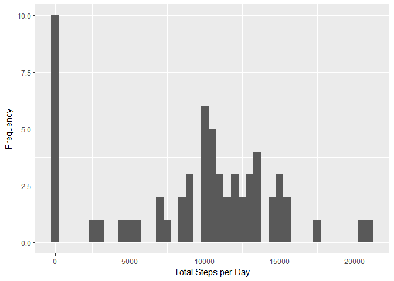
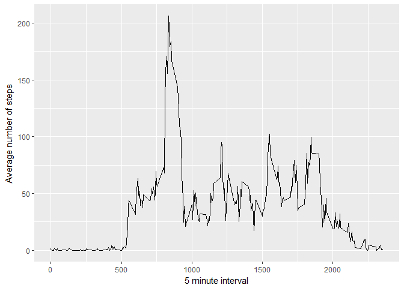
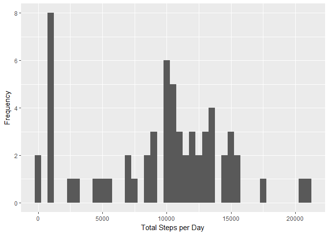
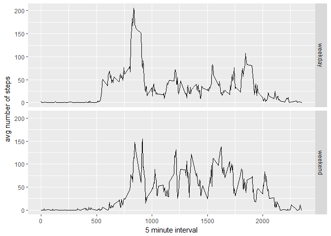

## Include libraries

```r
library (lubridate)
```

```
## Warning: package 'lubridate' was built under R version 3.4.2
```

```
## 
## Attaching package: 'lubridate'
```

```
## The following object is masked from 'package:base':
## 
##     date
```

```r
library (ggplot2)
```

```
## Warning: package 'ggplot2' was built under R version 3.4.2
```

```r
library (stringr)
```

```
## Warning: package 'stringr' was built under R version 3.4.3
```

```r
library (dplyr)
```

```
## Warning: package 'dplyr' was built under R version 3.4.2
```

```
## 
## Attaching package: 'dplyr'
```

```
## The following objects are masked from 'package:lubridate':
## 
##     intersect, setdiff, union
```

```
## The following objects are masked from 'package:stats':
## 
##     filter, lag
```

```
## The following objects are masked from 'package:base':
## 
##     intersect, setdiff, setequal, union
```

```r
library (knitr)
```

```
## Warning: package 'knitr' was built under R version 3.4.3
```

```r
library (impute)
```

```
## Warning: package 'impute' was built under R version 3.4.2
```

## Download data

```r
zipurl <- "https://d396qusza40orc.cloudfront.net/repdata%2Fdata%2Factivity.zip"
destzip <- "accelerometerdata.zip"
destfile <- "."
download.file(url=zipurl, destfile=destzip)
unzip(destzip)
```

## Load data

```r
df <- read.csv("activity.csv")
```

### Perform date-time processing; not used eventually

```r
#df$interval <- stringr::str_pad(as.character(df$interval),4,pad='0')
#df$interval <- paste(substr(df$interval,1,2), ':', substr(df$interval,3,4), sep="")
#df$date <- strptime(paste(df$date, df$interval), "%Y-%m-%d %H:%M")
```


## What is mean total number of steps taken per day?

```r
stepsDay <- tapply(df$steps, df$date, sum, na.rm=TRUE)
qplot(stepsDay, xlab='Total Steps per Day', ylab='Frequency', binwidth = 500)
```

<!-- -->

```r
stepsMean <- mean(stepsDay)
stepsMedian <- median(stepsDay)
```

* Mean number of steps: 9354.2295082
* Median number of steps: 10395

## What is the average daily activity pattern?

```r
avgStepsEachBlock <- aggregate(x=list(meanSteps=df$steps), by=list(interval=df$interval), FUN=mean, na.rm=TRUE)
```
## Time series plot of number of steps taken at different time intervals

```r
ggplot(data=avgStepsEachBlock, aes(x=interval, y=meanSteps)) + geom_line() + xlab("5 minute interval") +
    ylab("Average number of steps") 
```

<!-- -->

## Interval having the max number of steps on average

```r
maxSteps <- which.max(avgStepsEachBlock$meanSteps)
timeMaxSteps <- avgStepsEachBlock[maxSteps, 'interval']
timeMaxSteps <- stringr::str_pad(as.character(timeMaxSteps),4,pad='0')
timeMaxSteps <- paste(substr(timeMaxSteps,1,2),':', substr(timeMaxSteps,3,4), sep="")
```
* Max Steps at: 08:35

## Imputing missing values

```r
numNA <- length(which(is.na(df$steps)))  #number of missing values
```
Number of missing values: 2304

## Devise a strategy for filling in all of the missing values in the dataset

```r
#impute function just didn't work; tried all options
#finally dropped the idea and calculated median for intervals and used that instead
dfImputed <- df
narows <- is.na(dfImputed$steps)
avgInterval <- tapply(dfImputed$steps, dfImputed$interval, median, na.rm=TRUE, simplify = TRUE)
dfImputed$steps[narows] <- avgInterval[as.character(dfImputed$interval[narows])]

#dfImputed[is.na(dfImputed$steps),]$steps <- stepsMean/24/12  #daily mean per 5 mins; too simplistic
```


## What is mean and median total number of steps taken per day (after impute)?

```r
stepsImpDay <- tapply(dfImputed$steps, dfImputed$date, sum, na.rm=TRUE)
qplot(stepsImpDay, xlab='Total Steps per Day', ylab='Frequency', binwidth = 500)
```

<!-- -->

```r
stepsImpMean <- mean(stepsImpDay)
stepsImpMedian <- median(stepsImpDay)
```

* Mean number of steps (after impute): 9503.8688525
* Median number of steps (after impute): 10395


## Are there differences in activity patterns between weekdays and weekends?

```r
dfImputed$dateType <-  ifelse(as.POSIXlt(dfImputed$date)$wday %in% c(0,6), 'weekend', 'weekday')

avgdfImputed <- aggregate(steps ~ interval + dateType, data=dfImputed, mean)
ggplot(avgdfImputed, aes(x=interval, y=steps)) + geom_line() + facet_grid(dateType ~ .) + xlab("5 minute interval") + ylab("avg number of steps")
```

<!-- -->
